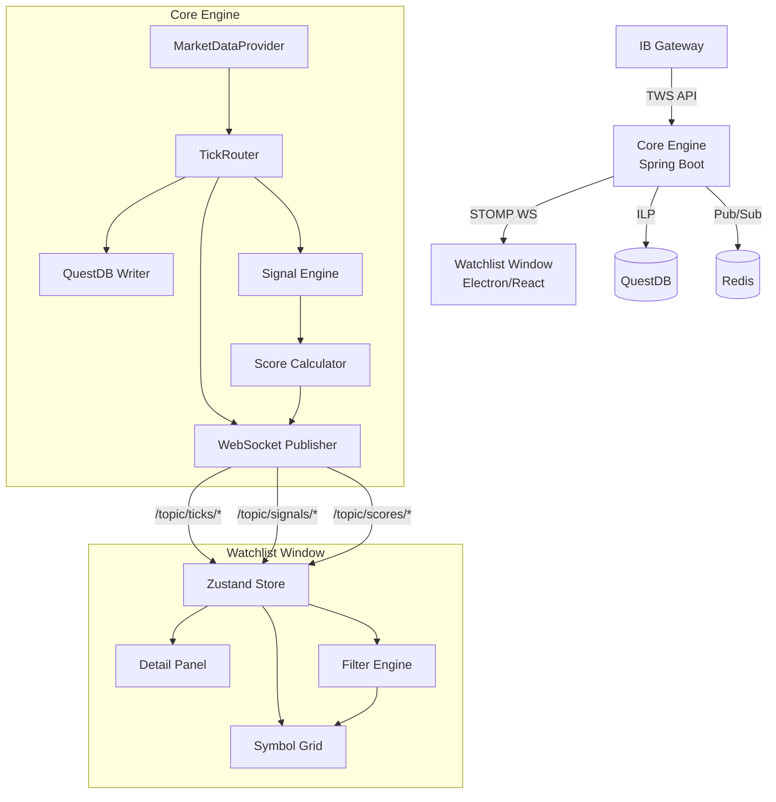

# SPEC-006: QuantStation — Multi-Watchlist Day Trading Command Center

| Field         | Value                            |
|:--------------|:---------------------------------|
| **Status**    | Draft                            |
| **Author**    | QuantStation Team                |
| **Created**   | 2026-08-03                       |
| **Updated**   | 2026-08-03                       |
| **Supersedes**| [SPEC-002](002-intel-dashboard.md) |
| **Platform**  | macOS / Apple Silicon (Mac Studio)|

---

## 1. Overview

The existing Intel Dashboard (SPEC-002) is a general-purpose 4-panel informational window with a flat watchlist, news feed, economic calendar, and daily checklist. While adequate for session preparation, it does not serve as a real-time decision support system during active trading.

This spec replaces the Intel Dashboard with a **Multi-Watchlist Day Trading Command Center** — a professional-grade screening and prioritization engine that maintains multiple specialized watchlists, each optimized for a different trading objective (momentum, gaps, breakouts, options flow, AI signals, etc.). The system aggregates signals across categories into a **Composite Opportunity Matrix**, enabling the trader to focus on the highest-conviction ideas first while still drilling into specialized views for detailed analysis.

### 1.1 Design Goals

1. **Multi-Watchlist Architecture** — Maintain 15+ categorized watchlists, each with purpose-specific computed columns, all sharing a common base schema.
2. **Real-Time Prioritization Engine** — Continuously recalculate composite scores and rankings as new market data, news, and signals arrive.
3. **Composite Opportunity Matrix** — A master ranking panel that aggregates signals across all categories into a single prioritized view.
4. **Symbol Detail Panel** — One-click drill-down displaying news, options chain summary, order flow, float, sector, and technical context.
5. **Conditional Formatting & Alerts** — Color-coded thresholds, flash animations, and multi-state alert lifecycle (Approaching → Triggered → Confirmed → Expired).
6. **Cross-Window Sync** — Selecting a symbol loads it into the Workspace execution window (charts, order book, order entry) via Electron IPC.
7. **Persistence** — Watchlist membership, custom filters, column preferences, and alert configurations persisted across sessions.

---

## 2. Window Layout

The Command Center occupies its own dedicated Electron `BrowserWindow` (replacing the current `intelWindow`), designed for a secondary monitor at 1600×1000 minimum resolution.

```
┌─────────────────────────────────────────────────────────────────────────────┐
│  QuantStation — Watchlists                              09:42:15 EST  ⚡   │
├───────────┬─────────────────────────────────────────────┬───────────────────┤
│           │                                             │                   │
│  Category │            Symbol Grid                      │   Detail Panel    │
│  Sidebar  │                                             │                   │
│           │  ┌─────────────────────────────────────────┐│  ┌─────────────┐  │
│  ⭐ Top   │  │ SYM  PRICE  CHG%  RVOL  SCORE  ALERT  ││  │ NVDA        │  │
│  🔥 Mom   │  │ NVDA 142.3  +4.2  5.8   96     BUY    ││  │ $142.30     │  │
│  💰 Gap↑  │  │ PLTR 38.9   +7.3  4.9   94     WATCH  ││  │ +4.2%       │  │
│  📉 Gap↓  │  │ SOFI 12.4   +3.1  3.2   91     --     ││  ├─────────────┤  │
│  📈 Brk↑  │  │ META 781.2  +1.8  2.1   90     --     ││  │ Latest News │  │
│  📉 Brk↓  │  │ AMD  198.7  +2.9  3.5   88     WATCH  ││  │ Options     │  │
│  ⚡ RVOL  │  └─────────────────────────────────────────┘│  │ Flow        │  │
│  🎯 Earn  │                                             │  │ Float/SI    │  │
│  🧠 AI    │  ┌── Filter Bar ──────────────────────────┐│  │ Sector      │  │
│  📊 Tech  │  │ RVOL > 3  AND  Score > 85  AND ...    ││  │ Technicals  │  │
│  📰 News  │  └─────────────────────────────────────────┘│  └─────────────┘  │
│  🏛️ Inst  │                                             │                   │
│  🔄 Sect  │                                             │                   │
│  🎯 Swing │                                             │                   │
│  ⚡ Scalp │                                             │                   │
│  ❤️ Favs  │                                             │                   │
│  📝 Manual│                                             │                   │
│           │                                             │                   │
├───────────┼─────────────────────────────────────────────┴───────────────────┤
│           │  Status: 847 symbols tracked │ 23 alerts active │ WS: ●        │
└───────────┴─────────────────────────────────────────────────────────────────┘
```

### 2.1 Panel Dimensions

| Panel | Width | Description |
|:------|:------|:------------|
| Category Sidebar | ~160px fixed | Vertical list of watchlist categories with emoji icons and unread/alert badge counts |
| Symbol Grid | Flexible (fills remaining) | Sortable, filterable data grid with category-specific columns |
| Detail Panel | ~320px fixed, collapsible | Contextual information for the currently selected symbol |
| Filter Bar | Full grid width, 36px height | Inline filter expression builder |
| Status Bar | Full width, 24px height | Connection status, symbol count, active alerts |

---

## 3. Watchlist Categories

### 3.0 Composite Opportunity Matrix (⭐ Top Opportunities)

Aggregates the top-ranked symbols across all categories into a single prioritized ranking.

> [!NOTE]
> The default landing category is **TBD** — will be decided after all categories are fully implemented. During development, the Manual category serves as the starting default.

| Column | Source | Description |
|:-------|:-------|:------------|
| Rank | Computed | Position in composite ranking |
| Symbol | Base | Ticker |
| Overall Score | Computed | Weighted composite of all category scores (0–100) |
| Primary Setup | Computed | Dominant category classification (e.g., "Momentum + Breakout") |
| Price | Live | Current price |
| Change % | Live | Daily percentage change |
| RVOL | Live | Relative volume vs 20-day average |
| AI Score | Engine | ML confidence score |
| Trade Grade | Engine | Letter grade (A+, A, B+, B, C) |
| Key Reasons | Computed | Concatenated top 3 signal reasons |
| Alert | Computed | Trigger state |

### 3.1 Momentum Candidates (🔥)

Stocks already moving with strong directional momentum.

| Column | Description |
|:-------|:------------|
| Symbol, Price, Change % | Base |
| RVOL | Relative volume |
| Volume | Current session volume |
| Float | Float shares |
| VWAP Distance | % distance from VWAP |
| HOD / LOD | High/Low of day |
| Distance to HOD | % from current high of day |
| Momentum Score | Composite momentum metric (0–100) |
| News Score | NLP-derived headline impact |
| Option Activity | Unusual options flag |

### 3.2 Gap Up (💰)

Pre-market and opening gap-up candidates.

| Column | Description |
|:-------|:------------|
| Gap % | Pre-market gap percentage |
| Premarket Volume | Pre-market volume |
| Premarket High | Pre-market high price |
| Opening Range | First 5-minute range |
| Float | Float shares |
| Catalyst | Gap catalyst tag |
| ATR | Average True Range |
| News | Latest headline |
| Options Volume | Intraday options volume |

### 3.3 Gap Down (📉)

Mean reversion, short selling, and dead-cat bounce candidates.

| Column | Description |
|:-------|:------------|
| Gap % | Pre-market gap-down percentage |
| Support | Nearest support level |
| Short % | Short interest as % of float |
| Float | Float shares |
| Borrow Rate | Short borrow fee |
| News | Latest headline |
| RVOL | Relative volume |

### 3.4 Breakout Watch (📈)

Symbols approaching or breaking key resistance levels.

| Column | Description |
|:-------|:------------|
| Resistance | Key resistance price |
| Distance | % to resistance |
| Breakout Score | ML probability of breakout (0–100) |
| Volume Spike | Current volume vs average |
| ADX | Average Directional Index |
| RSI | Relative Strength Index |
| MACD | MACD signal status |
| Trend Strength | Multi-timeframe trend alignment |

### 3.5 Breakdown Watch (📉)

Symbols approaching or breaking key support levels.

| Column | Description |
|:-------|:------------|
| Support | Key support price |
| Distance | % to support |
| Sell Volume | Cumulative sell-side volume |
| Bear Score | Composite bearish metric (0–100) |
| Lower Low? | Boolean: new lower low today |
| Trend | Multi-timeframe trend direction |

### 3.6 High Relative Volume (⚡)

Volume-driven screening for unusual activity.

| Column | Description |
|:-------|:------------|
| RVOL | Relative volume ratio |
| Current Volume | Today's volume |
| Average Volume | 20-day average volume |
| Volume Spike % | Current bar vs average bar |
| Volume Trend | Rising / Falling / Flat |
| Block Trades | Count of block-size prints |
| Dark Pool % | Estimated dark pool volume % |

### 3.7 Options Activity (🎯)

Unusual options flow and positioning.

| Column | Description |
|:-------|:------------|
| Option Volume | Total options volume |
| Call/Put Ratio | Ratio of call to put volume |
| Gamma Exposure | Net dealer gamma exposure |
| Delta | Aggregate delta |
| IV Rank | Implied volatility percentile rank |
| IV Percentile | IV percentile vs 52-week range |
| Open Interest | Total open interest |
| Unusual Options | Boolean: unusual activity detected |
| Max Pain | Options max pain strike |
| Expected Move | Implied expected move for next session |

### 3.8 Earnings Watch (📅)

Symbols with upcoming or recent earnings events.

| Column | Description |
|:-------|:------------|
| Days Until Earnings | Calendar days to report |
| EPS Estimate | Consensus EPS |
| Revenue Estimate | Consensus revenue |
| Whisper Number | Unofficial estimate |
| Historical Move | Average post-earnings move |
| IV Crush % | Expected IV contraction |
| Analyst Rating | Consensus rating |
| Price Target | Consensus target |

### 3.9 AI / Quant Signals (🧠)

Generated entirely by the QuantStation engine.

| Column | Description |
|:-------|:------------|
| HMM Regime | Hidden Markov Model state (Bull/Bear/Neutral) |
| Volatility State | Current volatility regime |
| Trend Probability | Probability trend continues |
| Bull Probability | Probability of bullish move |
| Bear Probability | Probability of bearish move |
| Expected Return | Model-predicted next-session return |
| Expected Risk | Model-predicted downside risk |
| Kelly % | Kelly criterion position size |
| Win Probability | Historical win rate for this setup |

### 3.10 Technical Setup (📊)

Classical technical analysis screening.

| Column | Description |
|:-------|:------------|
| 20 EMA, 50 EMA, 200 EMA | Moving average prices |
| Golden Cross / Death Cross | Boolean crossover flags |
| ADX | Trend strength |
| RSI | Momentum oscillator |
| MACD | Trend-following momentum |
| VWAP | Volume-weighted average price |
| Bollinger Band Width | Bollinger squeeze indicator |
| ATR | Average True Range |

### 3.11 News Driven (📰)

NLP-filtered headline-driven screening.

| Column | Description |
|:-------|:------------|
| Headline | Latest headline text |
| Sentiment | NLP sentiment (Bullish / Bearish / Neutral) |
| Source | News source |
| Impact Score | Predicted market impact (0–100) |
| Time | Headline timestamp |
| Filing Type | SEC filing type if applicable |

### 3.12 Institutional Flow (🏛️)

Dark pool, block trade, and insider activity screening.

| Column | Description |
|:-------|:------------|
| Dark Pool % | Dark pool volume percentage |
| Block Trades | Count of block-size prints |
| Insider Buying | Recent insider buy $ |
| Insider Selling | Recent insider sell $ |
| 13F Change | Quarterly institutional position change |
| ETF Flow | Net ETF inflow/outflow |
| Smart Money Score | Composite institutional sentiment (0–100) |

### 3.13 Sector Rotation (🔄)

Sector-level relative strength and rotation analysis.

| Column | Description |
|:-------|:------------|
| Sector | GICS sector name |
| Sector Rank | Rank among 11 sectors |
| Sector Momentum | Sector-level momentum score |
| Relative Strength | Stock vs sector RS ratio |
| Leading Stock | Top performer in sector |
| Lagging Stock | Worst performer in sector |
| Correlation to SPY | Beta-adjusted correlation |

### 3.14 Swing Candidates (🎯)

Multi-day hold candidates for swing trading.

| Column | Description |
|:-------|:------------|
| Trend | Daily trend direction |
| Weekly RSI | Weekly RSI value |
| Daily RSI | Daily RSI value |
| Monthly Trend | Monthly trend direction |
| Support | Nearest support |
| Resistance | Nearest resistance |
| Risk/Reward | Calculated R:R ratio |

### 3.15 Scalping (⚡)

Ultra-fast updating microstructure data for intraday scalping.

| Column | Description |
|:-------|:------------|
| Spread | Current bid-ask spread |
| L2 Imbalance | Level II bid/ask size imbalance |
| Bid Size | Aggregate bid depth |
| Ask Size | Aggregate ask depth |
| Tape Speed | Prints per second |
| Order Flow | Net buy/sell pressure |
| Micro Pullback | Boolean: pullback within trend |
| Liquidity Score | Ease-of-execution score (0–100) |

### 3.16 Favorites (❤️)

User-curated personal watchlist. Inherits universal base columns only. Symbols are manually added/removed by the trader.

### 3.17 Manual (📝)

A general-purpose scratch watchlist for ad-hoc analysis. The trader manually adds symbols of interest throughout the trading day regardless of category criteria. This serves as the **initial default landing category** during development before automated category population is implemented.

| Column | Description |
|:-------|:------------|
| Symbol, Price, Change % | Base |
| RVOL | Relative volume |
| Volume | Current session volume |
| ATR | Average True Range |
| Spread | Bid-ask spread |
| Float | Float shares |
| Market Cap | Market capitalization |
| Notes | User-entered text notes per symbol |
| Tags | User-defined color tags for grouping |

Unlike Favorites (which is a curated "best of" list meant to persist), Manual is a working scratchpad — symbols are expected to rotate frequently within and across sessions.

---

## 4. Universal Base Schema

Every watchlist category inherits a common base record. Category-specific columns are computed overlays on top of this base.

```typescript
interface WatchlistSymbol {
  // Identity
  symbol: string
  companyName: string
  sector: string
  industry: string

  // Live Market Data (from WebSocket tick stream)
  price: number
  changePercent: number
  volume: number
  rvol: number
  bidPrice: number
  askPrice: number
  spread: number

  // Reference Data (loaded on startup / periodically refreshed)
  atr: number
  float: number
  marketCap: number
  beta: number
  shortFloatPercent: number
  borrowRate: number
  prevClose: number

  // Computed / AI-Driven
  overallScore: number      // 0-100 composite
  tradeGrade: string        // A+, A, B+, B, C
  alertState: AlertState    // APPROACHING | TRIGGERED | CONFIRMED | EXPIRED | NONE

  // Metadata
  categories: string[]      // Which watchlist categories this symbol belongs to
  addedAt: number           // Timestamp when added
  scoreHistory: number[]    // Rolling score history for trend detection
}
```

---

## 5. Detail Panel

When a symbol is selected (single-click) in the grid, the right-side Detail Panel populates with contextual information organized into collapsible accordion sections:

| Section | Content |
|:--------|:--------|
| **Header** | Symbol, company name, price, change %, sparkline mini-chart |
| **Latest News** | 3-5 most recent headlines with sentiment badges |
| **Options Summary** | IV rank, put/call ratio, unusual activity flag, max pain, expected move |
| **Order Flow** | Net delta, cumulative buy/sell pressure, block trade history |
| **Float & Short Interest** | Float shares, short %, borrow rate, days to cover |
| **Sector Context** | Sector name, sector rank, relative strength vs sector |
| **Technical Snapshot** | Key levels (support/resistance), EMA alignment, RSI, MACD status |
| **AI Summary** | HMM regime, confidence, trend persistence, one-line AI recommendation |

Clicking a symbol in the Detail Panel header (or double-clicking in the grid) triggers `symbol:select` IPC to load it into the Workspace execution window.

---

## 6. Conditional Formatting & Color Coding

### 6.1 Semantic Color System

| Color | CSS Variable | Meaning |
|:------|:-------------|:--------|
| Green | `--qs-green` | Bullish / positive change |
| Dark Green | `--qs-green-strong` | Strong bullish (Score > 90, RVOL > 5) |
| Red | `--qs-red` | Bearish / negative change |
| Orange / Amber | `--qs-amber` | Warning / approaching threshold |
| Purple | `--qs-purple` | AI opportunity / quant signal |
| Blue | `--qs-blue` | Institutional activity |
| Yellow | `--qs-yellow` | Earnings-related |
| Cyan | `--qs-cyan` | Unusual options activity |

### 6.2 Configurable Thresholds

Users can define thresholds that trigger conditional formatting:

| Metric | Default Threshold | Visual Effect |
|:-------|:------------------|:-------------|
| RVOL | > 3.0 | Bold amber text |
| RVOL | > 5.0 | Bold + amber background pulse |
| AI Score | > 90 | Purple glow badge |
| Spread | < 0.05% | Green (excellent liquidity) |
| Spread | > 0.5% | Red (poor liquidity) |
| Change % | > +5% | Dark green highlight |
| Change % | < -5% | Dark red highlight |
| Short Float | > 20% | Orange badge |

---

## 7. Filter & Ranking Engine

### 7.1 Filter Expression Builder

The filter bar at the bottom of the grid accepts logical filter expressions that combine criteria across any column:

```
(MomentumScore > 90) AND (RVOL > 3) AND (MarketCap > 5B)
```

```
(HMM_Regime == Bull_LowVol) AND (Options.UnusualActivity == TRUE) AND NOT (EarningsWithinDays <= 1)
```

The parser supports: `AND`, `OR`, `NOT`, `>`, `<`, `>=`, `<=`, `==`, `!=`, parenthetical grouping, and value suffixes (`B` = billion, `M` = million, `K` = thousand, `%` = percentage).

### 7.2 Dynamic Ranking

Scores are recalculated continuously as new data arrives:
- Composite scores update on each WebSocket tick
- Category membership is re-evaluated every 5 seconds
- The Composite Opportunity Matrix re-ranks on each score update
- Score trend (strengthening / weakening) is tracked via rolling history

### 7.3 Alert Lifecycle

Alerts progress through defined states:

```
APPROACHING -> TRIGGERED -> CONFIRMED -> EXPIRED
```

| State | Meaning | Visual |
|:------|:--------|:-------|
| APPROACHING | Within 2% of trigger condition | Amber pulse dot |
| TRIGGERED | Condition met | Green flash + notification |
| CONFIRMED | Condition held for 30+ seconds | Solid green badge |
| EXPIRED | Condition no longer met | Grey strikethrough |

---

## 8. Data Architecture

### 8.1 Data Flow



### 8.2 New WebSocket Topics

| Topic | Payload | Frequency | Description |
|:------|:--------|:----------|:------------|
| `/topic/ticks/{symbol}` | `Tick` | Real-time | Existing - price, bid/ask, volume |
| `/topic/signals/{symbol}` | `SignalUpdate` | On change | New - category membership changes, alert state transitions |
| `/topic/scores/composite` | `ScoreSnapshot[]` | Every 5s | New - batch update of composite scores for all tracked symbols |
| `/topic/watchlist/scan` | `ScanResult[]` | Every 30s | New - scanner results for dynamic watchlist population |

### 8.3 New REST Endpoints

| Method | Path | Description |
|:-------|:-----|:------------|
| `GET` | `/api/watchlist/categories` | List all watchlist categories and their symbol counts |
| `GET` | `/api/watchlist/{category}` | Get symbols and computed columns for a specific category |
| `POST` | `/api/watchlist/favorites` | Add/remove symbols from Favorites |
| `GET` | `/api/watchlist/composite` | Get the current Composite Opportunity Matrix |
| `GET` | `/api/symbol/{symbol}/detail` | Get full detail panel data for a symbol |
| `POST` | `/api/watchlist/filter` | Apply a filter expression and return matching symbols |
| `GET` | `/api/watchlist/alerts` | Get all active alerts across categories |
| `PUT` | `/api/watchlist/preferences` | Save user column/filter/alert preferences |
| `GET` | `/api/watchlist/preferences` | Load user preferences |

### 8.4 Persistence

| Data | Store | Reason |
|:-----|:------|:-------|
| Favorites watchlist | Redis (`qs:watchlist:favorites`) | Survives restarts |
| Column preferences per category | Redis (`qs:watchlist:prefs:{category}`) | User customization |
| Filter expressions | Redis (`qs:watchlist:filters`) | Saved filters |
| Alert configurations | Redis (`qs:watchlist:alerts`) | Active alert rules |
| Selected category | localStorage | Per-window session state |
| Detail panel collapse state | localStorage | UI preference |

---

## 9. Electron IPC Updates

### 9.1 Updated IPC Channels

| Channel | Direction | Payload | Description |
|:--------|:----------|:--------|:------------|
| `symbol:select` | Watchlist -> Main | `string` (symbol) | Load symbol into Workspace (single-click in detail header or double-click in grid) |
| `symbol:update` | Main -> Workspace | `string` (symbol) | Route selected symbol to main window |
| `window:open-watchlist` | Any -> Main | None | Open/focus the Watchlist window |

### 9.2 Window Configuration

| Property | Value |
|:---------|:------|
| Title | `QuantStation - Watchlists` |
| Default Size | 1600 x 1000 |
| Min Size | 1200 x 700 |
| Route | `#/watchlist` |
| Menu Label | `Watchlists` (replaces `Intel Dashboard` in View menu) |

---

## 10. Phased Implementation Roadmap

Each phase is detailed in its own sub-specification document.

| Phase | Name | Sub-Spec | Focus |
|:------|:-----|:---------|:------|
| 1 | Foundation (MVP) | [SPEC-006-1](006-1-watchlist-phase1-foundation.md) | 3-panel layout, Manual + Favorites categories, base columns, sorting, conditional formatting, Detail panel, IPC sync |
| 2 | Scoring & Filters | SPEC-006-2 (planned) | Composite scoring engine, filter expression builder, alert lifecycle, column preferences |
| 3 | AI & Advanced Signals | SPEC-006-3 (planned) | HMM regime, AI/ML scores, breakout models, scanner-based population |
| 4 | Institutional & Options Flow | SPEC-006-4 (planned) | Dark pool, unusual options, gamma exposure, insider activity, sector rotation |

---

## 11. UI & Workflow Recommendations

- **Pinned columns:** Symbol, Last Price, % Change, Overall Score, and Alert are always visible regardless of horizontal scroll position.
- **Keyboard navigation:** Arrow keys navigate rows; `Enter` loads symbol into Workspace; `Space` toggles Favorite; `Esc` clears selection.
- **Multi-timeframe indicators:** Show trend alignment for 1m, 5m, 15m, 1h, and 1D timeframes as colored dots (green = up, red = down, grey = flat).
- **Persistence metrics:** Track how long a symbol has remained in a watchlist and whether its score is strengthening (up arrow) or weakening (down arrow).
- **One-click drill-down:** Selecting a symbol opens synchronized chart, Level II, time and sales, news, options, and position panels in the Workspace window.
- **Badge counts:** Each category in the sidebar shows a badge count of symbols currently matching that category's criteria, plus an alert badge for active triggers.
- **Compact density:** Grid row height of 28px with `JetBrains Mono 11px` for maximum data density.

---

## 12. Performance Targets

| Metric | Target |
|:-------|:-------|
| Grid render (500 symbols) | < 16ms per frame (60fps) |
| Category switch | < 100ms |
| Filter apply | < 200ms |
| Score recalculation | < 50ms per batch |
| Memory footprint | < 150MB for 1000 symbols |
