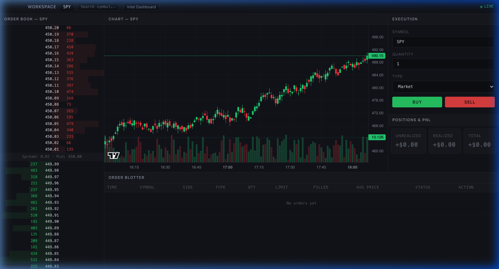
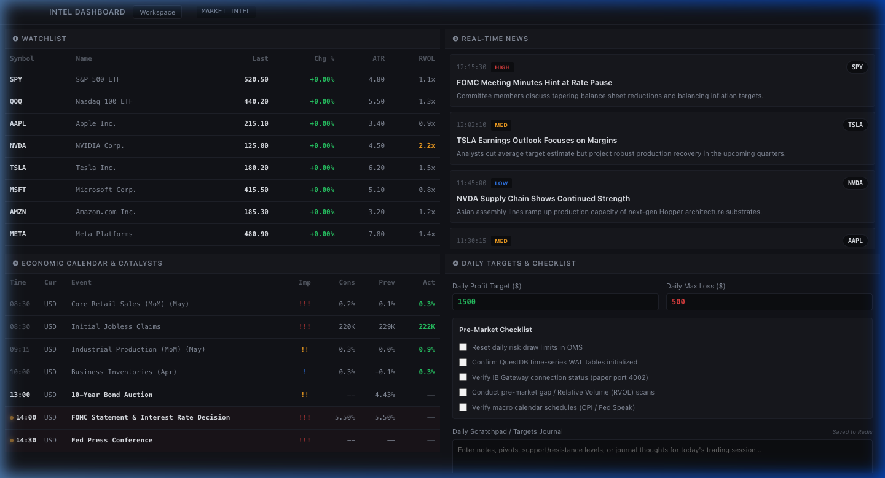
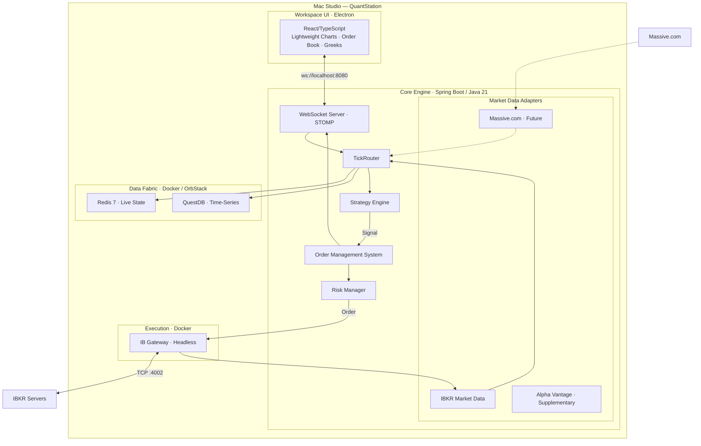

# QuantStation

> Single-workstation, ultra-low latency trading architecture for Mac Studio

### 🖥️ Workspace Window


### 📊 Intel & Watchlist Dashboard


## Architecture



## Port Mapping

| Service               | Port   | Protocol  | Purpose              |
|:----------------------|:-------|:----------|:---------------------|
| Spring Boot WebSocket | `8080` | WS/STOMP  | UI ↔ Backend         |
| Spring Boot Actuator  | `8081` | HTTP      | Health, metrics      |
| QuestDB Web Console   | `9002` | HTTP      | Admin/debug          |
| QuestDB ILP           | `9009` | TCP       | Tick ingestion       |
| QuestDB PG Wire       | `8812` | TCP       | SQL queries          |
| Redis                 | `6379` | TCP       | State read/write     |
| IB Gateway Paper      | `4002` | TCP       | Paper trading        |
| IB Gateway Live       | `4001` | TCP       | Live trading         |
| IB Gateway VNC        | `5900` | TCP       | Debug GUI (optional) |

## Prerequisites

- **macOS** on Apple Silicon (Mac Studio recommended)
- **OrbStack** (preferred) or Docker Desktop with VirtioFS
- **Java 21 LTS** (via SDKMAN or Homebrew)
- **Node.js 20+** with **pnpm** (`npm i -g pnpm`)
- **Interactive Brokers** account (paper trading)

## Quick Start

```bash
# 1. Clone and enter
cd quantstation

# 2. Configure IB Gateway credentials
cp .env.example .env
# Edit .env with your IBKR credentials

# 3. Start everything
bash scripts/start-pod.sh

# 4. Stop everything
bash scripts/stop-pod.sh
```

## Project Structure

```
quantstation/
├── infra/              # Docker Compose, QuestDB, Redis, IB Gateway configs
├── core-engine/        # Spring Boot 3 + Java 21 (the brain)
├── workspace-ui/       # Electron + React/TypeScript (the UI)
└── scripts/            # Orchestration and maintenance scripts
```

## Architecture Planes

### Execution Plane
Order state management → Risk validation → IB Gateway routing.
Spring Boot's `execution/` package owns the entire order lifecycle.

### Data Fabric
Market data ingestion → Redis (live state) → QuestDB (time-series storage).
The `marketdata/` package handles adapters (IBKR, Massive.com, Alpha Vantage).

### Dual-Window UI System
The workspace is split into two specialized desktop windows to support multi-monitor workstation setups:
1. **Workspace Window**: Main charting interface, live order book, and order execution tools.
2. **Intel Dashboard Window**: A secondary window displaying daily watchlists, economic calendars, live news feeds, and daily checklist logs.

Windows can be closed individually and reopened dynamically at any time using the macOS menu bar or standard keyboard shortcuts (`Cmd+N` / `Cmd+I`) without restarting the application.

### Zero-Latency IPC Sync
An Electron IPC event router handles instantaneous cross-window state synchronization. For example, selecting or clicking any ticker in the *Intel Dashboard* watchlist automatically triggers an immediate update to the active chart and order book symbols in the main *Workspace* window.

### Session State Persistence
Trader checklists and daily note states are persisted in Redis via Spring Boot REST APIs. Keyboard inputs are debounced by 1 second to optimize write loads, ensuring that state is saved seamlessly across sessions and window restarts.
